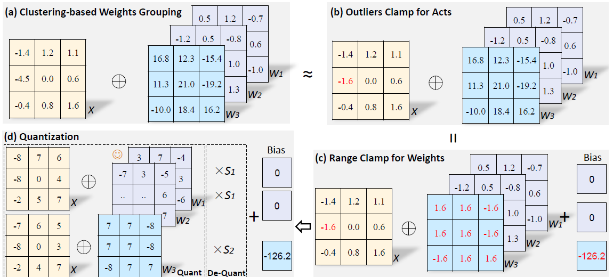

# Contents

- [Contents](#contents)
    - [AdderQuant Description](#AdderQuant-description)
    - [Quantization Algorithm](#Quantization-Algorithm)
    - [Dataset](#dataset)
    - [Environment Requirements](#environment-requirements)
    - [Script description](#script-description)
        - [Script and sample code](#script-and-sample-code)
    - [Eval process](#eval-process)
        - [Usage](#usage)
        - [Launch](#launch)
        - [Result](#result)
    - [ModelZoo Homepage](#modelzoo-homepage)

## [AdderQuant Description](#contents)

Existing AdderNet quantization techniques propose to
use only one shared scale to quantize both the weights and activations simultaneously.  
We propos a new quantization algorithm by redistributing the weights and the activations. Specifically, the pre-trained
full-precision weights in different kernels are clustered into different groups, then
the intra-group sharing and inter-group independent scales can be adopted. To
further compensate the accuracy drop caused by the distribution difference, we
then develop a lossless range clamp scheme for weights and a simple yet effective
outliers clamp strategy for activations. Thus, the functionality of full-precision
weights and the representation ability of full-precision activations can be fully
preserved.
> [Paper](https://openreview.net/pdf?id=ZuSiW0EixjX): Redistribution of Weights and Activations for
> AdderNet Quantization.
> Ying Nie, Kai Han1, Haikang Diao, Chuanjian Liu, Enhua Wu, Yunhe Wang

## [Quantization Algorithm](#contents)


The illustration of the proposed quantization method for AdderNet (symmetric 4-bit as an
example). The pre-trained full-precision weights are clustered into different groups. Then the clamp
scheme for weights and activations are explored respectively to make efficient use of the precious
bits and eliminate the negative impact of outliers.

## [Dataset](#contents)

Note that you can run the scripts based on the dataset mentioned in original paper or widely used in relevant
domain/network architecture. In the following sections, we will introduce how to run the scripts using the related
dataset below.

Dataset used: [CIFAR-10](<http://www.cs.toronto.edu/~kriz/cifar.html>)

- Dataset size：175M，60,000 32*32 colorful images in 10 classes
    - Train：146M，50,000 images
    - Test：29.3M，10,000 images
- Data format：binary files
    - Note：Data will be processed in dataset.py
- Download the dataset, the directory structure is as follows:

```cifar10
├─cifar-10-batches-bin
│
└─cifar-10-verify-bin
```

## [Environment Requirements](#contents)

- Hardware(GPU)
    - Prepare hardware environment with GPU.
- Framework
    - [MindSpore](https://www.mindspore.cn/install/en)
- For more information, please check the resources below£º
    - [MindSpore Tutorials](https://www.mindspore.cn/tutorials/en/master/index.html)
    - [MindSpore Python API](https://www.mindspore.cn/docs/en/master/api_python/mindspore.html)

## [Script description](#contents)

### [Script and sample code](#contents)

```bash
AdderQuant
.
├── README.md                 # Readme file
├── adder_quant.py            # AdderNet with Quantization Algorithm
├── eval.py                   # Evaluation
├── requirements.txt          # requirements
└── res20_adder.py            # Resnet with Addernet Conv

```

## [Eval process](#contents)

### Usage

After installing MindSpore via the official website, you can start evaluation as follows:

### Launch

```bash
# infer example
  # python
  GPU: python eval.py --checkpoint_file_path path/to/ckpt --train_dataset_path path/to/cifar-10-batches-bin --eval_dataset_path path/to/cifar-10-verify-bin
```

> checkpoint can be downloaded at https://download.mindspore.cn/model_zoo/research/cv/AdderQuant/
### Result

Quantization results of AdderNets(ResNet-20 with 90.44full-precision) on CIFAR-10:

| Bits | PTQ(%) |
|------|--------|
| 8    | 91.36  |
| 6    | 91.21  |
| 5    | 90.86  |
| 4    | 90.27  |

## [ModelZoo Homepage](#contents)

Please check the official [homepage](https://gitee.com/mindspore/models).